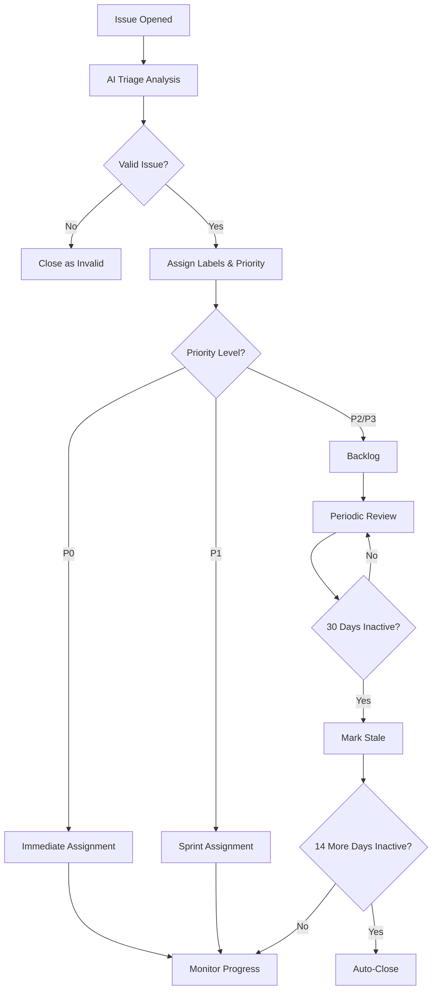

# Issue Triage SOP (Standard Operating Procedure)

## Purpose

This document defines the standard operating procedure for triaging issues in the SMRT repository. It ensures consistent, efficient, and fair handling of all reported issues, bugs, and feature requests.

## Overview

The SMRT repository uses **AI-powered automated triage** via the `@happyvertical/github-actions` package, combined with manual review processes to ensure all issues are properly categorized, prioritized, and addressed.

## Triage Priority System

Issues are classified using a four-level priority system:

### P0 - Critical (Immediate Attention)
- **Response Time**: Within 1 hour
- **Resolution Target**: Same day
- **Examples**:
  - Production is completely broken
  - Security vulnerabilities
  - Data loss or corruption issues
  - Critical dependency failures

**Actions**: Immediate team notification, assign to on-call engineer, create hotfix branch

### P1 - High Priority (Within 24 Hours)
- **Response Time**: Within 4 hours
- **Resolution Target**: Within 2-3 days
- **Examples**:
  - Major functionality broken for all users
  - Blocking issues preventing development
  - Performance degradation affecting usability
  - Build or CI/CD pipeline failures

**Actions**: Assign to appropriate team member, add to current sprint

### P2 - Medium Priority (Within 1 Week)
- **Response Time**: Within 2 business days
- **Resolution Target**: Within 1-2 weeks
- **Examples**:
  - Non-blocking bugs
  - Feature requests with clear use cases
  - Documentation gaps
  - Minor performance issues
  - Usability improvements

**Actions**: Add to backlog, review in weekly planning

### P3 - Low Priority (Backlog)
- **Response Time**: Within 1 week
- **Resolution Target**: As capacity allows
- **Examples**:
  - Nice-to-have features
  - Minor cosmetic issues
  - Edge case bugs with workarounds
  - Long-term improvements

**Actions**: Add to backlog, review quarterly

## Issue Classification

### Bug Reports
Issues describing unexpected behavior or broken functionality.

**Required Information**:
- Clear description of the problem
- Steps to reproduce
- Expected vs actual behavior
- Version information
- Environment details

**Labels**: `bug`, priority label (P0-P3), component labels

### Feature Requests
Proposals for new functionality or enhancements.

**Required Information**:
- Problem being solved
- Proposed solution
- Use cases and examples
- Alternatives considered

**Labels**: `enhancement`, priority label (P1-P3), component labels

### Documentation
Issues related to missing, incorrect, or unclear documentation.

**Labels**: `documentation`, priority label (P2-P3)

### Questions
Requests for clarification or help using the framework.

**Labels**: `question`, possibly `documentation` if reveals gaps

**Note**: Questions should ideally be directed to GitHub Discussions or Stack Overflow. If a question reveals documentation gaps, convert to documentation issue.

## Automated Triage Process

### On Issue Creation

The AI-powered triage action (`@happyvertical/github-actions`) automatically:

1. **Analyzes Issue Content**: Uses AI to understand the issue description
2. **Suggests Labels**: Recommends appropriate labels based on content
3. **Detects Duplicates**: Identifies similar existing issues
4. **Assigns Initial Priority**: Suggests priority based on severity
5. **Adds Context**: Comments with triage analysis and suggestions

### AI Triage Analysis

The AI analyzes:
- Issue title and description
- Code snippets and error messages
- Referenced packages and files
- Similar past issues
- Project context and patterns

Output includes:
- Recommended labels
- Suggested priority
- Related issues (if found)
- Triage confidence score
- Additional context or questions

## Manual Triage Process

### Step 1: Initial Review (Within Response Time)

**Reviewer Actions**:
1. Read the AI triage analysis
2. Verify the issue is valid and clear
3. Confirm or adjust suggested labels
4. Confirm or adjust priority
5. Add component-specific labels

**Invalid Issues**:
- Spam or off-topic: Close with `invalid` label
- Duplicates: Close with `duplicate` label, link to original
- Unclear/incomplete: Request more information, add `needs-info` label

### Step 2: Categorization

**Add Appropriate Labels**:
- **Type**: `bug`, `enhancement`, `documentation`, `question`
- **Priority**: `P0-critical`, `P1-high`, `P2-medium`, `P3-low`
- **Component**: Package or area affected (e.g., `core`, `agents`, `vite-plugin`)
- **Status**: `needs-info`, `blocked`, `ready`, `in-progress`

### Step 3: Assignment

**P0-Critical**:
- Auto-assign to on-call engineer or maintainer
- Create Slack/Discord notification
- Create hotfix branch if needed

**P1-High**:
- Assign to appropriate team member based on component
- Add to current sprint/milestone

**P2-Medium & P3-Low**:
- Add to backlog
- Optionally assign if clear owner
- Add `good first issue` if suitable for new contributors

### Step 4: Communication

**Acknowledge Receipt**:
```markdown
Thank you for reporting this issue! We've triaged it as [priority] and
[assigned/added to backlog]. [Additional context about timeline or next steps].
```

**Request More Information**:
```markdown
Thank you for the report. To help us investigate, could you please provide:
- [Specific information needed]
- [Steps to reproduce if missing]
- [Environment details if relevant]
```

**Close as Duplicate**:
```markdown
Thanks for reporting! This appears to be a duplicate of #[number].
Please follow that issue for updates. If you believe this is actually a
different issue, please let us know and we'll reopen.
```

## Stale Issue Management

Issues without activity are automatically managed:

### Stale Detection (After 30 Days)
- Bot adds `stale` label
- Posts comment:
  ```
  This issue has been automatically marked as stale due to inactivity.
  It will be closed in 14 days if no further activity occurs.
  ```

### Closure (After 14 More Days)
- If no response, bot closes issue
- Posts comment:
  ```
  This issue was automatically closed due to inactivity. If you believe
  this issue is still relevant, please reopen it and provide updated context.
  ```

### Exempt Issues
Issues with these labels are **never** marked stale:
- `long-term` - Long-term initiatives
- `blocked` - Waiting on external dependencies
- `on-hold` - Intentionally paused
- `P0-critical` - Critical issues stay active
- `P1-high` - High priority issues stay active

## Special Cases

### Security Issues
**DO NOT** open public issues for security vulnerabilities.

1. Use GitHub Security Advisories (private)
2. Or email maintainers directly: [security@example.com]
3. Allow 90 days for fix before disclosure
4. Coordinate disclosure timing with maintainers

**Priority**: Always P0-critical

### Breaking Changes
Issues proposing breaking changes require:
- RFC (Request for Comments) process
- Community discussion period (minimum 2 weeks)
- Approval from at least 2 maintainers
- Migration guide documentation
- Major version bump

**Labels**: `breaking-change`, `RFC`, priority P2+

### Good First Issues
Suitable characteristics:
- Well-defined scope
- Clear acceptance criteria
- No complex context required
- Documented codebase area
- Estimated < 4 hours work

**Labels**: `good first issue`, `documentation`, or simple `bug` fixes

## Triage Workflow Reference



## Metrics and Monitoring

Track these metrics monthly:
- **Response Time**: Time from open to first triage
- **Resolution Time**: Time from open to close
- **Backlog Health**: Number of P1/P2 issues > 30 days old
- **Stale Rate**: Percentage of issues marked stale
- **AI Accuracy**: Percentage of AI suggestions accepted

**Goals**:
- P0 response: < 1 hour (100%)
- P1 response: < 4 hours (95%)
- P2 response: < 2 days (90%)
- Backlog health: < 10 issues > 30 days old

## Tools and Resources

- **AI Triage Action**: `.github/actions/issue-triage`
- **Triage Config**: `.github/triage-config.json`
- **Issue Templates**: `.github/ISSUE_TEMPLATE/`
- **Workflows**: `.github/workflows/on-issue-opened.yml`

## Updating This SOP

This SOP should be reviewed quarterly and updated as needed. Changes require:
1. Discussion in maintainer meeting
2. PR with proposed changes
3. Approval from at least 2 maintainers
4. Update date stamp below

---

**Last Updated**: 2025-10-23
**Version**: 1.0.0
**Maintainers**: @happyvertical/maintainers
