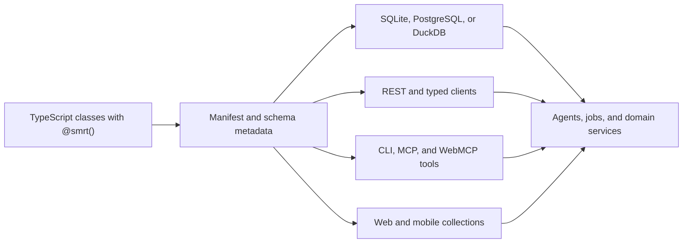

# s-m-r-t framework

**Define business objects once. Use them through persistence, REST, CLI, MCP,
agents, web clients, and native apps.**

s-m-r-t is a TypeScript framework for building operational software and vertical
AI agents around the same typed domain model. Decorated classes become
manifest-described objects with portable persistence, generated interfaces,
tenant-aware relationships, AI operations, and reusable domain packages.

It is designed for systems where the difficult part is keeping data,
permissions, tools, background work, user interfaces, and automation aligned as
the domain grows—not merely implementing one endpoint or agent prompt. The
repository contains 61 top-level platform packages published primarily under
`@happyvertical/smrt-*`, plus a private playground test-host workspace.

## Define once, expose deliberately



Generation is allowlist-driven. A model does not become publicly writable just
because it exists: each `@smrt()` declaration controls its REST, CLI, MCP, AI,
cache, tenancy, and lifecycle surface.

## Requirements

- Node.js 24.18 or newer
- pnpm 11.13.1 or newer (11.13.0 is a broken release pnpm itself refuses)
- A supported database adapter (SQLite is convenient for local development; PostgreSQL and DuckDB are supported where documented)

## Quick start

```bash
pnpm init
pnpm pkg set type=module
pnpm add @happyvertical/smrt-config @happyvertical/smrt-core
pnpm add --save-dev @happyvertical/smrt-cli @types/node vite typescript
mkdir -p src
```

Save this as `src/product.ts`:

<!-- quickstart:start -->
```typescript
import { ObjectRegistry, SmrtCollection, SmrtObject, smrt } from '@happyvertical/smrt-core';

ObjectRegistry.registerPackageManifest(
  new URL('../.smrt/manifest.json', import.meta.url),
);

@smrt({ api: true, cli: true, mcp: true })
export class Product extends SmrtObject {
  name: string = '';
  price: number = 0.0; // decimal schema field
  quantity: number = 0; // integer schema field
}

export class ProductCollection extends SmrtCollection<Product> {
  static readonly _itemClass = Product;
}

const database = {
  type: 'sqlite' as const,
  url: process.env.DATABASE_URL ?? 'products.db',
};
const products = await ProductCollection.create({ db: database, persistence: database });
const product = await products.create({
  name: 'Field Recorder',
  price: 299.99,
  quantity: 4,
});
await product.save();
```
<!-- quickstart:end -->

Configure the supported build-time scanner in `vite.config.ts`:

```typescript
import { smrtPlugin } from '@happyvertical/smrt-core/vite-plugin';
import { defineConfig } from 'vite';

export default defineConfig({
  oxc: { decorator: { legacy: true, emitDecoratorMetadata: true } },
  plugins: [smrtPlugin({ include: ['src/**/*.ts'] })],
});
```

Configure the CLI database in `smrt.config.ts` (the `db:*` commands read
`packages.cli.database`; they do not read `DATABASE_*` directly):

```typescript
import { defineConfig } from '@happyvertical/smrt-config';

export default defineConfig({
  packages: {
    cli: {
      database: {
        type: 'sqlite',
        url: process.env.DATABASE_URL ?? 'products.db',
      },
    },
  },
});
```

Generate the manifest, apply its schema to the fresh SQLite database, and only
then run the example. The example explicitly registers that generated
application manifest before creating the collection:

```bash
DATABASE_URL=products.db pnpm vite build --ssr src/product.ts
DATABASE_URL=products.db pnpm smrt db:migrate
DATABASE_URL=products.db node dist/product.js
```

Running the built `dist/product.js` entry preserves the manifest-registration call
in the executable output, where its `../.smrt/manifest.json` URL resolves to the
manifest generated by the scanner. `@smrt()` makes the class discoverable to
that build-time scanner. Enabling `api`, `cli`, and `mcp` declares generated
surfaces. `smrt db:migrate` is the supported manifest-driven setup and migration
path; runtime initialization verifies application schema rather than creating it
implicitly.

For framework invariants and production setup, read [the repository guide](./AGENTS.md) and [the core package documentation](./packages/core/README.md).

## Platform capabilities

- **Domain-first ORM:** typed objects, collections, relationships, tenancy, STI, migrations, and portable database adapters.
- **Generated interfaces:** REST, CLI, MCP, manifests, web collection definitions, and mobile contracts from one model graph.
- **AI runtime:** object-level `is()`/`do()`, prompts, agents, personas, learning memory, jobs, and observability signals.
- **Reusable vertical packages:** identity, content, commerce, sales, support, projects, media, analytics, and more.
- **Cross-platform clients:** Svelte 5 UI, browser data runtime, Kotlin Multiplatform foundations, Android Compose, and SwiftUI.

## Choose your path

| Goal | Start here |
| --- | --- |
| Learn the object and collection model | [`smrt-core`](./packages/core/README.md) |
| Start a SvelteKit application | [`smrt-template-sveltekit`](./packages/template-sveltekit/README.md) |
| Run a local, self-hosted, or cloud application | [`smrt-app-runtime`](./packages/app-runtime/README.md) |
| Build agents and personas | [`smrt-agents`](./packages/agents/README.md), [`smrt-personas`](./packages/personas/README.md) |
| Add tenant-aware identity and authorization | [`smrt-tenancy`](./packages/tenancy/README.md), [`smrt-users`](./packages/users/README.md) |
| Build live or offline browser data | [`smrt-web`](./packages/smrt-web/README.md), [`smrt-svelte`](./packages/smrt-svelte/README.md) |
| Expose an application CLI or MCP server | [`smrt-app-cli`](./packages/app-cli/README.md), [`smrt-app-mcp`](./packages/smrt-app-mcp/README.md) |
| Use an existing business domain | Browse the linked package catalog below |
| Extend or review the framework | [`AGENTS.md`](./AGENTS.md), [`smrt-dev-mcp`](./packages/smrt-dev-mcp/README.md) |

## Package catalog

Status legend:

- **Stable** — established public package contract.
- **Preview** — public and usable, with an actively evolving contract.
- **Experimental** — incomplete or exploratory; evaluate before production use.
- **Internal** — repository tooling or platform package, not a general npm API.
- **Deprecated** — compatibility only; follow its migration guide.

### Foundation and tooling

| Package | Status | Purpose |
| --- | --- | --- |
| [`smrt-core`](./packages/core/README.md) | Stable | ORM, decorators, registries, code generation, AI operations, and runtime services. |
| [`smrt-types`](./packages/types/README.md) | Stable | Shared framework types and enums. |
| [`smrt-config`](./packages/config/README.md) | Stable | Configuration loading, validation, redaction, and static export. |
| [`smrt-scanner`](./packages/scanner/README.md) | Stable | OXC-based TypeScript metadata scanner. |
| [`smrt-tenancy`](./packages/tenancy/README.md) | Stable | Tenant context, interceptors, and isolation adapters. |
| [`smrt-vitest`](./packages/vitest/README.md) | Stable | Manifest-aware Vitest integration and database isolation. |
| [`smrt-cli`](./packages/cli/README.md) | Stable | Developer CLI, schema commands, generation, and knowledge tooling. |
| [`smrt-app-cli`](./packages/app-cli/README.md) | Preview | Reusable branded application CLI and stdio MCP bridge. |
| [`smrt-app-runtime`](./packages/app-runtime/README.md) | Preview | Validated local, self-hosted, and cloud composition with safe bootstrap, provider diagnostics, and profile-selected workers. |
| [`smrt-workbench`](./packages/smrt-workbench/README.md) | Preview | CWD-scoped package and project workbench for docs, APIs, routes, previews, and knowledge. |
| [`smrt-workbench-host`](./packages/smrt-workbench/host/README.md) | Internal | Private SvelteKit browser host bundled with the workbench package. |
| [`smrt-dev-mcp`](./packages/smrt-dev-mcp/README.md) | Stable | Development MCP server and repository knowledge tools. |
| [`smrt-app-mcp`](./packages/smrt-app-mcp/README.md) | Preview | App-runtime MCP server and transport adapters. |
| [`smrt-mcp-conformance-fixture`](./packages/mcp-conformance-fixture/README.md) | Internal | Generated Tier-1 MCP 2026-07-28 conformance gate. |
| [`smrt-bundle-gate`](./packages/bundle-gate/README.md) | Internal | Consumer bundle reachability and size regression gate. |

### Agents, identity, and operations

| Package | Status | Purpose |
| --- | --- | --- |
| [`smrt-agents`](./packages/agents/README.md) | Stable | Agent lifecycle, discovery, dispatch, and scheduling. |
| [`smrt-jobs`](./packages/jobs/README.md) | Stable | Durable background jobs, task runners, and schedules. |
| [`smrt-users`](./packages/users/README.md) | Stable | Users, tenants, sessions, RBAC, permissions, and RLS. |
| [`smrt-profiles`](./packages/profiles/README.md) | Stable | Identity profiles, authentication bindings, and relationships. |
| [`smrt-personas`](./packages/personas/README.md) | Preview | Context-scoped agent personas and governed learning loop. |
| [`smrt-playbooks`](./packages/playbooks/README.md) | Preview | Layered playbook registry, overrides, and plan resolution. |
| [`smrt-prompts`](./packages/prompts/README.md) | Stable | Typed prompt registry and tenant-aware overrides. |
| [`smrt-projects`](./packages/projects/README.md) | Preview | Provider-neutral projects, repositories, issues, and delivery work. |
| [`smrt-support`](./packages/support/README.md) | Preview | Support Case intake, lifecycle, routing, targets, and service time. |

### Content and media

| Package | Status | Purpose |
| --- | --- | --- |
| [`smrt-content`](./packages/content/README.md) | Stable | Versioned content, documents, mirrors, thumbnails, and citations. |
| [`smrt-assets`](./packages/assets/README.md) | Stable | Provider-neutral asset identity, versions, metadata, and lineage. |
| [`smrt-assets-local`](./packages/assets-local/README.md) | Preview | Local image metadata and deterministic variant processing. |
| [`smrt-assets-ergot`](./packages/assets-ergot/README.md) | Preview | Ergot processing, search, workflow, and synchronization adapter. |
| [`smrt-images`](./packages/images/README.md) | Stable | Image categorization, editing, search, and asset extensions. |
| [`smrt-video`](./packages/video/README.md) | Stable | Video production models, scenes, performers, and workflows. |
| [`smrt-voice`](./packages/voice/README.md) | Stable | Voice profiles, synthesis, cloning, and word timing. |
| [`smrt-messages`](./packages/messages/README.md) | Stable | Provider-neutral multi-channel messages and credentials. |
| [`smrt-chat`](./packages/chat/README.md) | Stable | Rooms, DMs, threads, sessions, and agent conversations. |
| [`smrt-social`](./packages/social/README.md) | Stable | Social account OAuth, publishing, and scheduling. |

### Business and domain

| Package | Status | Purpose |
| --- | --- | --- |
| [`smrt-commerce`](./packages/commerce/README.md) | Stable | Customers, vendors, contracts, invoices, and fulfillment. |
| [`smrt-products`](./packages/products/README.md) | Stable | Product catalog and triple-consumption package template. |
| [`smrt-sales`](./packages/sales/README.md) | Preview | Agreements, CRM, referrals, commissions, and sales surfaces. |
| [`smrt-affiliates`](./packages/affiliates/README.md) | Deprecated | Compatibility shim over the `smrt-sales` commissions core. |
| [`smrt-subscriptions`](./packages/subscriptions/README.md) | Preview | Plans, entitlements, usage, pricing, and spending policies. |
| [`smrt-ledgers`](./packages/ledgers/README.md) | Stable | Double-entry accounting and journal lifecycle. |
| [`smrt-ads`](./packages/ads/README.md) | Stable | Ad selection, variation testing, and immutable delivery events. |
| [`smrt-analytics`](./packages/analytics/README.md) | Stable | Analytics properties, streams, events, and reports. |
| [`smrt-reports`](./packages/reports/README.md) | Preview | Materialized aggregate definitions and refresh orchestration. |
| [`smrt-marketing`](./packages/marketing/README.md) | Preview | Campaign coordination, budgets, evidence, and Svelte surfaces. |
| [`smrt-inventory`](./packages/inventory/README.md) | Preview | SKUs, stock locations, levels, movements, and mutation service. |
| [`smrt-manufacturing`](./packages/manufacturing/README.md) | Preview | Bills of materials, cost rollups, and production orders. |
| [`smrt-events`](./packages/events/README.md) | Stable | Nested events, series, participants, and placements. |
| [`smrt-places`](./packages/places/README.md) | Stable | Place hierarchies, geocoding, and proximity queries. |
| [`smrt-facts`](./packages/facts/README.md) | Stable | Knowledge facts, provenance, confidence, and evolution. |
| [`smrt-sites`](./packages/sites/README.md) | Stable | Site lifecycle and agent bindings. |
| [`smrt-properties`](./packages/properties/README.md) | Stable | Digital properties and hierarchical content/ad zones. |
| [`smrt-tags`](./packages/tags/README.md) | Stable | Context-scoped hierarchical tags and aliases. |
| [`smrt-secrets`](./packages/secrets/README.md) | Stable | Tenant envelope encryption, rotation, and audit. |
| [`smrt-features`](./packages/features/README.md) | Preview | Code-first feature flags and tenant overrides. |
| [`smrt-languages`](./packages/languages/README.md) | Preview | Language strings, overrides, and translation jobs. |
| [`smrt-fields`](./packages/fields/README.md) | Preview | Layered field policy store, resolution engine, and form surfaces. |

### Web, mobile, and templates

| Package | Status | Purpose |
| --- | --- | --- |
| [`smrt-ui`](./packages/smrt-ui/README.md) | Stable | Domain-neutral Svelte primitives, themes, i18n, and module UI registry. |
| [`smrt-svelte`](./packages/smrt-svelte/README.md) | Stable | Shared Svelte 5 framework components and application shells. |
| [`smrt-web`](./packages/smrt-web/README.md) | Preview | Reactive browser collections, offline outbox, persistence, and live invalidation. |
| [`smrt-playground`](./packages/smrt-playground/README.md) | Preview | Package playground discovery, runtime, and host components. |
| [`smrt-playground-host`](./packages/smrt-playground/host/README.md) | Internal | Private SvelteKit end-to-end test host for the playground runtime. |
| [`smrt-mobile-contract`](./packages/smrt-mobile-contract/README.md) | Preview | Manifest-to-Kotlin/Swift contract generation. |
| [`smrt-mobile`](./packages/smrt-mobile/README.md) | Preview | Kotlin Multiplatform offline, sync, auth, and platform seams. |
| [`smrt-android`](./packages/smrt-android/README.md) | Internal | Android Compose foundation and native adapters. |
| [`smrt-ios`](./packages/smrt-ios/README.md) | Internal | SwiftUI foundation and native adapters. |
| [`smrt-template-sveltekit`](./packages/template-sveltekit/README.md) | Stable | Minimal SvelteKit application template. |
| [`smrt-template-site-static-json`](./packages/template-site-static-json/README.md) | Stable | Static JSON community-site template. |
| [`smrt-gnode`](./packages/gnode/README.md) | Experimental | Federation library; currently incomplete. |

## SDK dependencies

s-m-r-t composes infrastructure from the
[HappyVertical SDK](https://github.com/happyvertical/sdk), including database,
AI, filesystem, logging, messaging, and provider-neutral service adapters. Use
the framework packages for domain objects and generated application surfaces;
use the SDK directly when implementing infrastructure adapters or lower-level
services.

## Development

```bash
pnpm install
pnpm build
pnpm test
pnpm typecheck
pnpm lint
pnpm workbench
pnpm check:readmes
pnpm knowledge:check --strict --format markdown
```

Start with a package-scoped command (`pnpm --filter <package> ...`) before running relevant repository-wide validation. Do not create changesets manually; release automation generates them after merge.

Local SDK development helpers:

```bash
./setup-local-dev.sh
./restore-published-deps.sh
```

The first command links a sibling HappyVertical SDK checkout; the second restores registry dependencies.

## Documentation

- [Repository architecture and agent guidance](./AGENTS.md)
- [Core framework API and examples](./packages/core/README.md)
- [Package standards](./docs/content/standards.md)
- [UI surface conventions](./docs/ui-surfaces.md)
- [Documentation site](./docs/README.md)

The documentation build discovers package READMEs from workspace `package.json` files. `pnpm check:readmes` prevents missing package docs, stale catalog entries, broken local README links, obsolete branding, and unsupported quick-start drift.

## Related projects

- [HappyVertical SDK](https://github.com/happyvertical/sdk) — infrastructure packages used by s-m-r-t.
- [s-m-r-t SaaS starter](https://github.com/happyvertical/smrt-saas-starter) — reference application, demo, and template baseline.

## License

MIT — see [LICENSE](./LICENSE).
