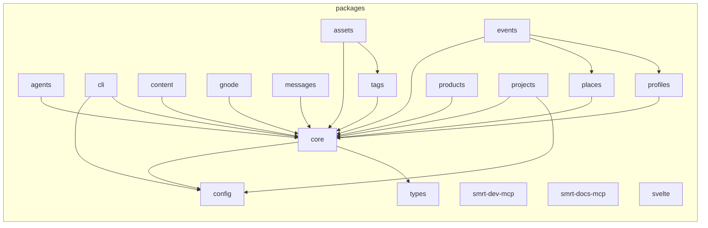

```mermaid
flowchart LR

subgraph 0["packages"]
1["agents"]
2["assets"]
3["cli"]
4["config"]
5["content"]
6["core"]
7["events"]
8["gnode"]
9["messages"]
A["places"]
B["products"]
C["profiles"]
D["projects"]
E["smrt-dev-mcp"]
F["smrt-docs-mcp"]
G["svelte"]
H["tags"]
I["types"]
end
1-->6
2-->6
2-->H
3-->4
3-->6
5-->6
6-->4
6-->I
7-->6
7-->A
7-->C
8-->6
9-->6
A-->6
B-->6
C-->6
D-->6
D-->4
H-->6
```
