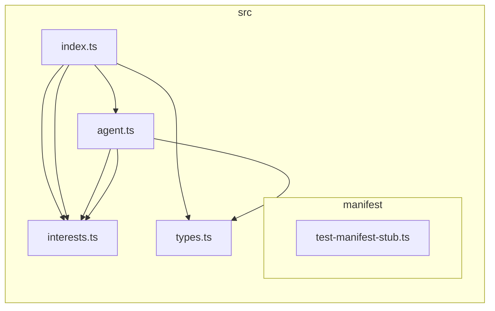

```mermaid
flowchart LR

subgraph 0["src"]
1["agent.ts"]
2["interests.ts"]
3["types.ts"]
4["index.ts"]
subgraph 5["manifest"]
6["test-manifest-stub.ts"]
end
end
1-->2
1-->2
1-->3
4-->1
4-->2
4-->2
4-->3
```
