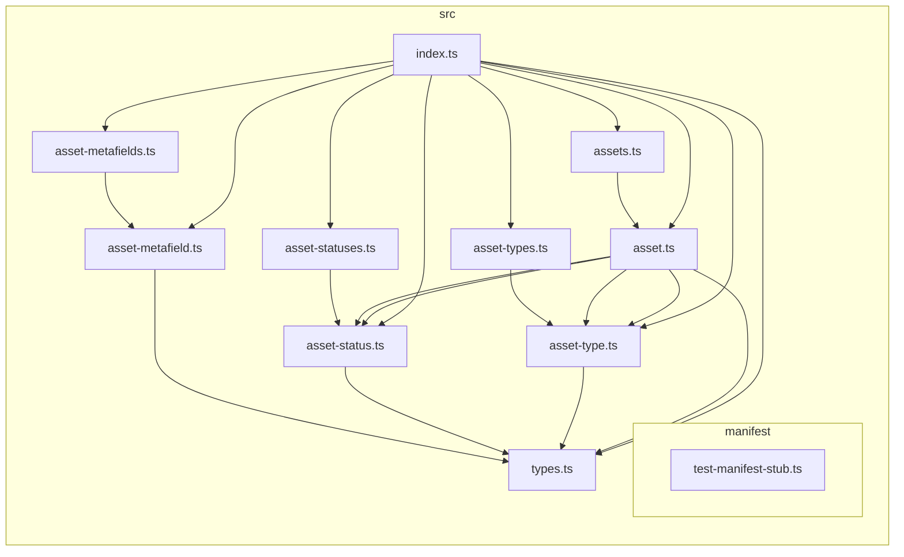

```mermaid
flowchart LR

subgraph 0["src"]
1["asset-metafield.ts"]
2["types.ts"]
3["asset-metafields.ts"]
4["asset-status.ts"]
5["asset-statuses.ts"]
6["asset-type.ts"]
7["asset-types.ts"]
8["asset.ts"]
9["assets.ts"]
A["index.ts"]
subgraph B["manifest"]
C["test-manifest-stub.ts"]
end
end
1-->2
3-->1
4-->2
5-->4
6-->2
7-->6
8-->4
8-->4
8-->6
8-->6
8-->2
9-->8
A-->8
A-->1
A-->3
A-->4
A-->5
A-->6
A-->7
A-->9
A-->2
```
