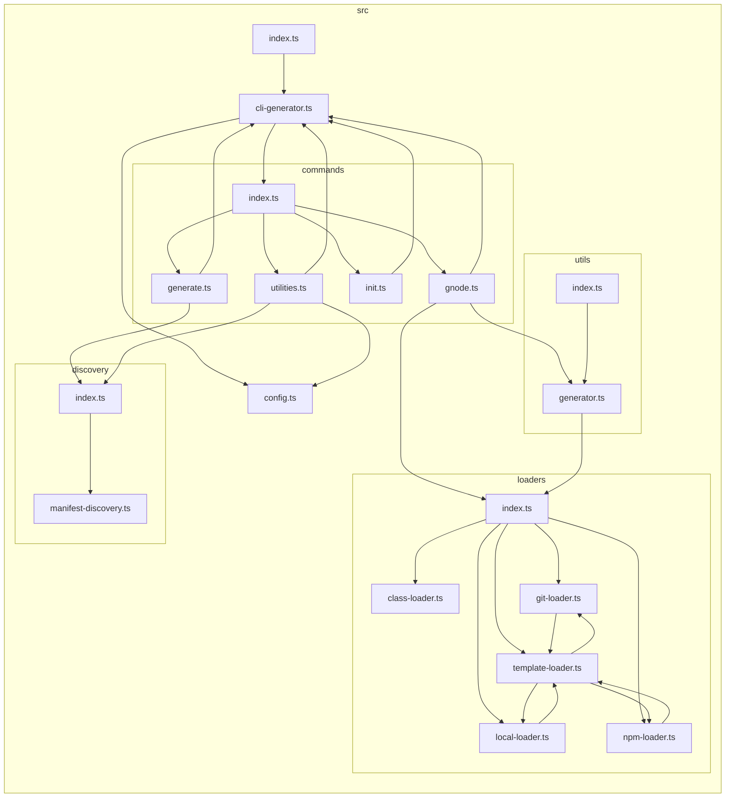

```mermaid
flowchart LR

subgraph 0["src"]
1["cli-generator.ts"]
subgraph 2["commands"]
3["index.ts"]
4["generate.ts"]
8["gnode.ts"]
I["init.ts"]
J["utilities.ts"]
end
subgraph 5["discovery"]
6["index.ts"]
7["manifest-discovery.ts"]
end
subgraph 9["loaders"]
A["index.ts"]
B["class-loader.ts"]
C["git-loader.ts"]
D["template-loader.ts"]
E["local-loader.ts"]
F["npm-loader.ts"]
end
subgraph G["utils"]
H["generator.ts"]
M["index.ts"]
end
K["config.ts"]
L["index.ts"]
end
1-->3
1-->K
3-->4
3-->8
3-->I
3-->J
4-->1
4-->6
6-->7
8-->1
8-->A
8-->H
A-->B
A-->C
A-->E
A-->F
A-->D
C-->D
D-->C
D-->E
D-->F
E-->D
F-->D
H-->A
I-->1
J-->1
J-->K
J-->6
L-->1
M-->H
```
