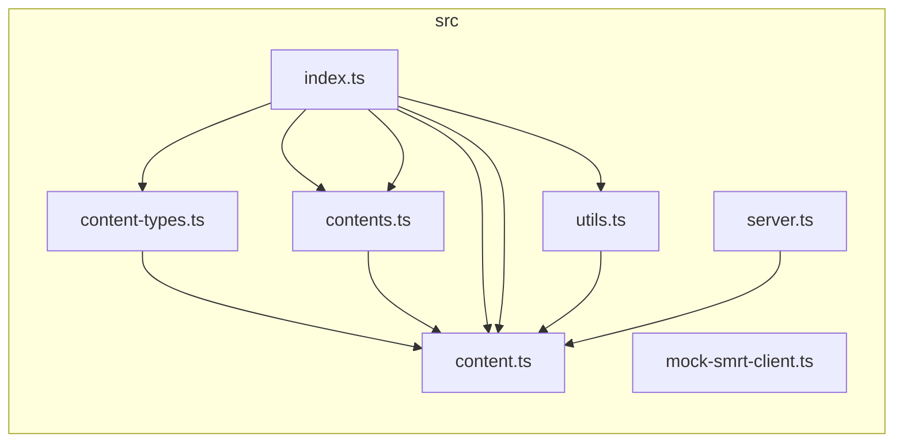

```mermaid
flowchart LR

subgraph 0["src"]
1["content-types.ts"]
2["content.ts"]
3["contents.ts"]
4["index.ts"]
5["utils.ts"]
6["mock-smrt-client.ts"]
7["server.ts"]
end
1-->2
3-->2
4-->2
4-->2
4-->1
4-->3
4-->3
4-->5
5-->2
7-->2
```
