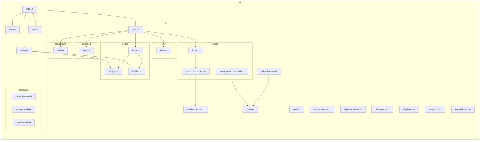

```mermaid
flowchart LR

subgraph 0["src"]
1["client.ts"]
subgraph 2["federation"]
3["consume.config.ts"]
4["expose.config.ts"]
5["shared.config.ts"]
end
6["index.ts"]
subgraph 7["lib"]
8["index.ts"]
subgraph 9["components"]
A["index.ts"]
end
subgraph B["generated"]
C["index.ts"]
end
subgraph D["models"]
E["index.ts"]
F["Category.ts"]
G["Product.ts"]
end
subgraph H["stores"]
I["index.ts"]
J["product-store.svelte.ts"]
R["product-store.client.svelte.ts"]
end
K["mock-smrt-client.ts"]
subgraph L["utils"]
M["index.ts"]
end
P["federation-entry.ts"]
Q["types.ts"]
end
N["mcp.ts"]
O["server.ts"]
S["main.ts"]
T["native-api-server.ts"]
U["simple-api-server.ts"]
V["simple-server.ts"]
W["simple-test.ts"]
X["test-imports.ts"]
Y["test-workspace.ts"]
end
6-->1
6-->8
6-->N
6-->O
8-->A
8-->C
8-->E
8-->I
8-->M
E-->F
E-->G
I-->J
J-->K
O-->F
O-->G
P-->Q
R-->Q
```
