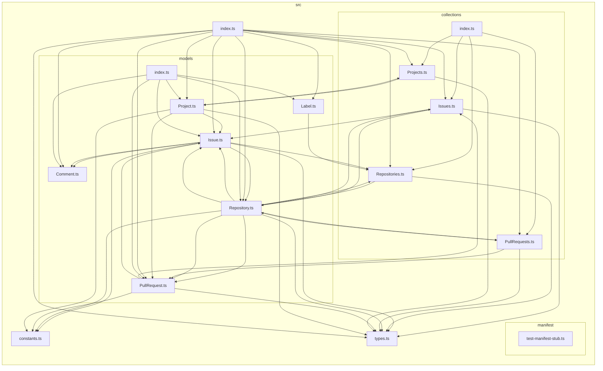

```mermaid
flowchart LR

subgraph 0["src"]
subgraph 1["collections"]
2["Issues.ts"]
5["Repositories.ts"]
7["PullRequests.ts"]
C["Projects.ts"]
E["index.ts"]
end
subgraph 3["models"]
4["Issue.ts"]
6["Repository.ts"]
8["PullRequest.ts"]
B["Comment.ts"]
D["Project.ts"]
G["Label.ts"]
J["index.ts"]
end
9["constants.ts"]
A["types.ts"]
F["index.ts"]
subgraph H["manifest"]
I["test-manifest-stub.ts"]
end
end
2-->4
2-->6
2-->A
4-->5
4-->9
4-->A
4-->B
4-->B
4-->6
5-->6
5-->A
6-->2
6-->7
6-->5
6-->9
6-->A
6-->4
6-->4
6-->8
6-->8
7-->8
7-->6
7-->A
8-->2
8-->9
8-->A
8-->4
C-->D
C-->A
D-->C
D-->9
D-->A
D-->4
D-->8
E-->2
E-->C
E-->7
E-->5
F-->2
F-->C
F-->7
F-->5
F-->B
F-->4
F-->G
F-->D
F-->8
F-->6
F-->A
G-->5
J-->B
J-->4
J-->G
J-->D
J-->8
J-->6
```
