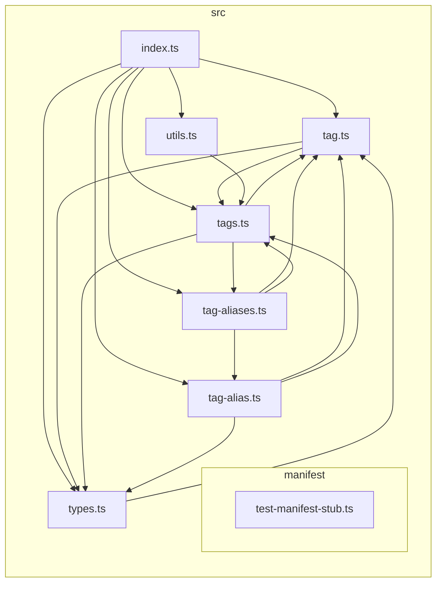

```mermaid
flowchart LR

subgraph 0["src"]
1["index.ts"]
2["tag.ts"]
3["tags.ts"]
4["tag-aliases.ts"]
5["tag-alias.ts"]
6["types.ts"]
7["utils.ts"]
subgraph 8["manifest"]
9["test-manifest-stub.ts"]
end
end
1-->2
1-->5
1-->4
1-->3
1-->6
1-->7
2-->3
2-->6
3-->2
3-->4
3-->6
4-->2
4-->5
4-->3
5-->2
5-->3
5-->6
6-->2
7-->3
```
